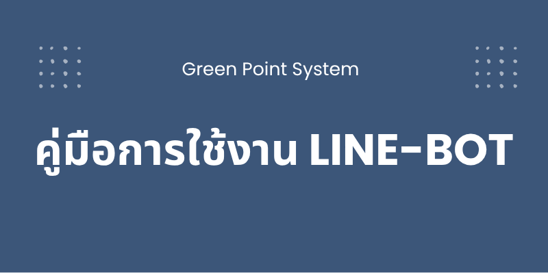

# 🌱 Green Point System

ระบบแต้มสะสมสีเขียว สำหรับส่งเสริมการแยกขยะรีไซเคิลในแผนกเทคโนโลยีสารสนเทศ วิทยาลัยเทคนิคเชียงใหม่

พัฒนาด้วย Web Technologies และเชื่อมต่อกับ Firebase Realtime Database พร้อมระบบ LINE Bot Integration



## 🌟 ฟีเจอร์หลัก

### 🎯 ระบบหลัก
- **ระบบแต้มสะสม**: ติดตามและจัดการแต้มของผู้ใช้แบบ Real-time
- **เชื่อมต่อ LINE Bot**: เข้าถึงข้อมูลผ่าน LINE Bot ได้ทันที
- **ระบบสมาชิก**: จัดการข้อมูลผู้ใช้และประวัติการใช้งาน
- **Dashboard**: หน้าแสดงสถิติและข้อมูลแต้มสะสม
- **Responsive Design**: รองรับการใช้งานบนทุกอุปกรณ์

### 🎮 ฟีเจอร์ของ Web Application
- **หน้าแรก**: แสดงข้อมูลเกี่ยวกับโครงการและวิธีการใช้งาน
- **User Dashboard**: หน้าจัดการข้อมูลส่วนตัวและแต้มสะสม
- **LINE Integration**: เชื่อมต่อบัญชี LINE เพื่อใช้งานผ่าน Bot
- **ประวัติการทำงาน**: ติดตามการเปลี่ยนแปลงแต้มทั้งหมด

## 🚀 การติดตั้งและใช้งาน

### 1. ข้อกำหนดเบื้องต้น
- Node.js (เวอร์ชัน 14 ขึ้นไป)
- Firebase Account
- LINE Developers Account (สำหรับ Bot Integration)
- Web Browser ที่รองรับ ES6+

### 2. ติดตั้ง Dependencies

```bash
npm install
```

### 3. ตั้งค่า Firebase

1. สร้างโปรเจกต์ใน [Firebase Console](https://console.firebase.google.com/)
2. เปิดใช้งาน **Realtime Database**
3. ตั้งค่า Database Rules:

```json
{
  "rules": {
    ".read": "auth != null",
    ".write": "auth != null",
    "users": {
      "$uid": {
        ".read": "$uid === auth.uid",
        ".write": "$uid === auth.uid"
      }
    }
  }
}
```

4. คัดลอก Firebase Configuration และอัปเดตในไฟล์ `user-ui.html`

### 4. การใช้งาน

#### สำหรับ Development
```bash
# เปิดไฟล์ index.html ใน browser
open index.html

# หรือใช้ Live Server
npx live-server
```

#### สำหรับ Production (Vercel)
```bash
# Deploy ไปยัง Vercel
vercel --prod
```

## 🏗️ สถาปัตยกรรม

### เทคโนโลยีที่ใช้
- **Frontend**: HTML5, CSS3, JavaScript (ES6+)
- **CSS Framework**: Bootstrap 5
- **Database**: Firebase Realtime Database
- **Integration**: LINE Bot API
- **Deployment**: Vercel
- **Font**: Google Fonts (Prompt)

### โครงสร้างข้อมูลใน Firebase

```json
{
  "users": {
    "[lineUserId]": {
      "name": "ชื่อผู้ใช้",
      "userId": "LINE User ID",
      "points": 100,
      "createdAt": "2025-01-01T00:00:00.000Z",
      "lastActive": "2025-01-31T12:00:00.000Z",
      "points_history": {
        "[historyId]": {
          "timestamp": 1640995200000,
          "change": 10,
          "note": "รับแต้มจากการแยกขยะ"
        }
      }
    }
  }
}
```

## 📁 โครงสร้างโปรเจกต์

```
GreenPointSystem/
├── 📄 index.html              # หน้าแรกของระบบ
├── 📄 user-ui.html           # หน้า Dashboard ผู้ใช้
├── 📄 package.json           # Dependencies
├── 📄 vercel.json           # Vercel configuration
├── 📄 README.md             # Documentation
├── 📁 css/                  # Stylesheets
│   ├── bootstrap.min.css    # Bootstrap framework
│   ├── style.css           # Custom styles
│   └── responsive.css      # Responsive design
├── 📁 js/                   # JavaScript files
│   ├── bootstrap.bundle.js # Bootstrap JS
│   └── jquery.min.js       # jQuery library
├── 📁 images/              # รูปภาพและ assets
│   ├── banner.png          # Banner หน้าแรก
│   ├── fevicon.png         # Favicon
│   └── guide.png           # รูปคู่มือการใช้งาน
├── 📁 doc/                 # เอกสารประกอบ
│   └── GPS.pdf             # คู่มือการใช้งาน
├── 📁 DOC1-5/              # เอกสารโปรเจกต์
└── 📁 Doc5/                # เอกสารเพิ่มเติม
```

## 🔗 การเชื่อมต่อ LINE Bot

### ขั้นตอนการเชื่อมต่อ
1. ผู้ใช้เข้าสู่ระบบผ่าน LINE Bot
2. Bot ส่งลิงก์ไปยัง Web Application
3. ระบบดึงข้อมูลจาก Firebase ตาม LINE User ID
4. แสดงข้อมูลแต้มและประวัติการใช้งาน

### URL Parameters
- `lineUserId`: LINE User ID สำหรับเชื่อมต่อข้อมูล

ตัวอย่าง:
```
https://green-point-system.vercel.app/user-ui.html?lineUserId=U1234567890
```

## 🎨 การออกแบบ

### การออกแบบ UI/UX
- **สีหลัก**: เขียว (#1DB446) - สื่อถึงความเป็นมิตรกับสิ่งแวดล้อม
- **Font**: Prompt (Thai Web Font)
- **Mobile First**: ออกแบบให้รองรับมือถือเป็นหลัก
- **Accessibility**: รองรับการใช้งานสำหรับผู้พิการ

### Responsive Breakpoints
- **Mobile**: < 576px
- **Tablet**: 576px - 768px
- **Desktop**: > 768px

## 🌐 การ Deploy

### Vercel (แนะนำ)
```bash
# ติดตั้ง Vercel CLI
npm i -g vercel

# Deploy
vercel

# Production deploy
vercel --prod
```

### การตั้งค่า Environment Variables
```bash
# ตั้งค่าใน Vercel Dashboard
FIREBASE_API_KEY=your_api_key
FIREBASE_AUTH_DOMAIN=your_project.firebaseapp.com
FIREBASE_DATABASE_URL=https://your_project.firebasedatabase.app
FIREBASE_PROJECT_ID=your_project_id
```

## 🔒 ความปลอดภัย

### Firebase Security Rules
- ตั้งค่า Authentication สำหรับ LINE Users
- จำกัดการเข้าถึงข้อมูลตาม User ID
- ป้องกัน XSS และ CSRF

### Best Practices
- ไม่เก็บข้อมูลสำคัญใน localStorage
- ใช้ HTTPS สำหรับการสื่อสาร
- Validate ข้อมูลทั้งฝั่ง Client และ Server

## 📊 ระบบการทำงาน

### Flow การใช้งาน
1. **ลงทะเบียน**: ผู้ใช้สมัครผ่าน LINE Bot
2. **รับแต้ม**: ได้รับแต้มจากการแยกขยะ
3. **ติดตาม**: ดูแต้มสะสมผ่าน Web หรือ LINE Bot
4. **แลกรางวัล**: ใช้แต้มแลกของรางวัล

## 🛠️ การพัฒนา

### การเพิ่มฟีเจอร์ใหม่
1. อัปเดต HTML structure
2. เพิ่ม CSS styles
3. เขียน JavaScript functions
4. ทดสอบการทำงานกับ Firebase
5. Deploy และทดสอบ

### การแก้ไข Bug
1. ตรวจสอบ Console Logs
2. ทดสอบกับ Firebase Rules
3. ตรวจสอบ Network Requests
4. อัปเดตโค้ดและ Deploy

## 📚 เอกสารประกอบ

- [📋 คู่มือการใช้งาน](doc/GPS.pdf)
- [🔧 เอกสารเทคนิค](DOC1-5/DOC_project.html)
- [📊 รายงานโปรเจกต์](Doc5/Doc5.html)

## 🤝 การมีส่วนร่วม

### วิธีการพัฒนาร่วม
1. Fork โปรเจกต์นี้
2. สร้าง Feature Branch (`git checkout -b feature/AmazingFeature`)
3. Commit การเปลี่ยนแปลง (`git commit -m 'Add some AmazingFeature'`)
4. Push ไปยัง Branch (`git push origin feature/AmazingFeature`)
5. เปิด Pull Request

### Code Style Guidelines
- ใช้ 2 spaces สำหรับ indentation
- ตั้งชื่อตัวแปรเป็นภาษาอังกฤษ
- เขียน comments เป็นภาษาไทย
- ใช้ Semantic HTML tags

### Links
- 🌐 **Production**: [green-point-system.vercel.app](https://green-point-system.vercel.app)
- 🤖 **LINE Bot**: [Line Bot Repository](https://github.com/arnakorn-k/line-bot)
- 📱 **Mobile App**: กำลังพัฒนา

---

## 🌍 ผลกระทบต่อสิ่งแวดล้อม

ระบบ Green Point System มีเป้าหมายเพื่อส่งเสริม:
- ♻️ การแยกขยะอย่างถูกต้อง
- 🌱 การรีไซเคิลในชุมชน
- 📊 การติดตามผลกระทบเชิงบวก
- 🏆 การสร้างแรงจูงใจผ่านระบบแต้มสะสม

> **"ทุกการกระทำเล็กๆ สามารถสร้างผลกระทบใหญ่ต่อโลกใบนี้"**
